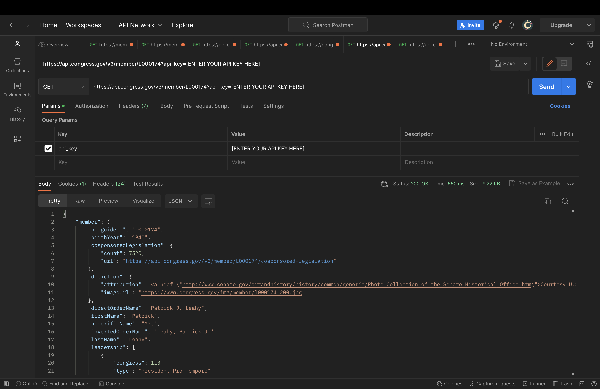
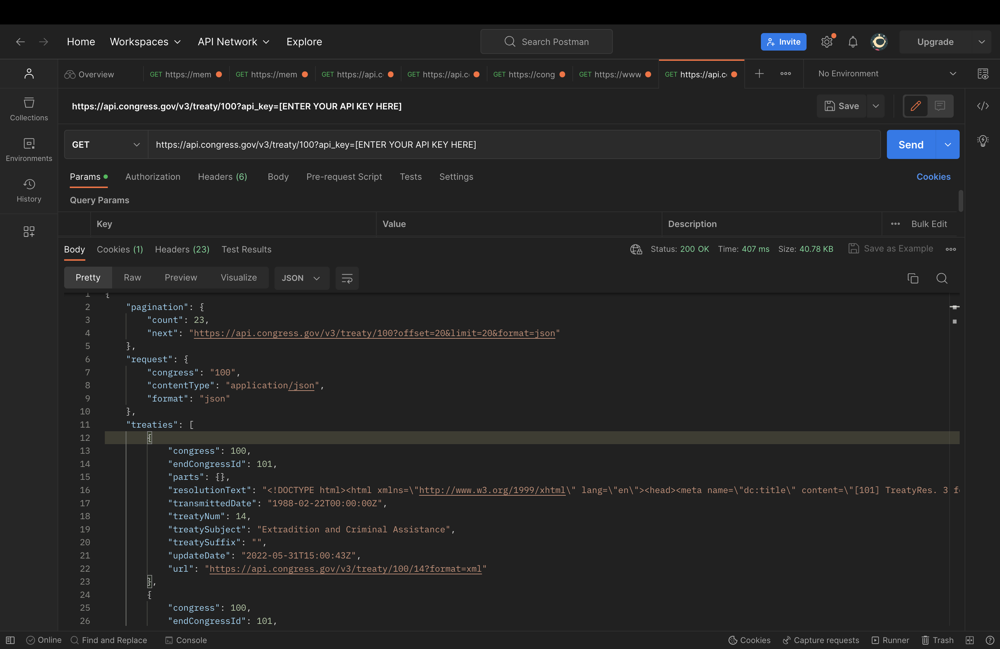
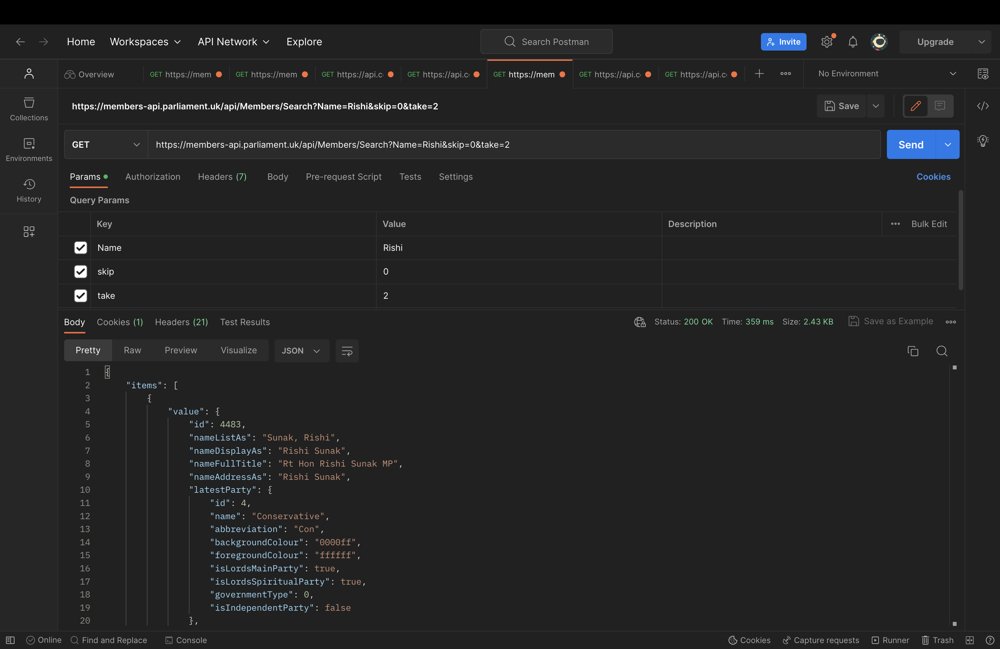
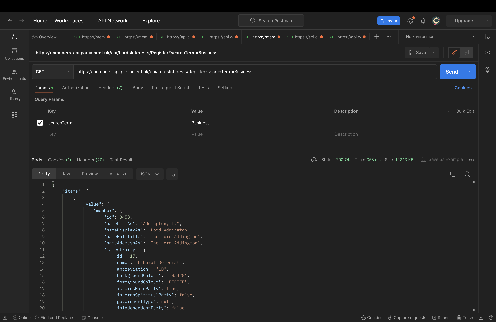

#  🏛 The US Congress & The UK Parliament

A website by the Lally Enthusiasts

## Project Description

The US Congress & The UK Parliament website is a dynamic React-based web application that calls APIs from two distinct sources: the Congress API and the Parliament API. The website compares information between the members and treaties of the United States Congress and members and treaties of the UK Parliament. Users can search for specific members and retrieve details about their respective legislatures.

### Project Features

- **Congress Page:** Allows users to search for members of the United States Congress by their unique BioGuide ID from the Biographical Directory of Congress. It provides information such as full name, member type, state, and party affiliation. It also has a treaty search feature where the user can input a treaty number to retrieve the transmitted date and treaty subject. 

- **Parliament Page:** Enables users to search for members of the UK Parliament by their names. It displays details like full name, gender, party, latest membership placement, start date, end date (if not in office), and membership status. [[complete this after treaty]]

## APIs Used

### 1. Congress API

- **API Provider:** [congress.gov](https://www.loc.gov/apis/additional-apis/congress-dot-gov-api/ )
- **Extra Documentation:** [Congress BriefEndpointsDocumentation.md](https://github.com/LibraryOfCongress/api.congress.gov/blob/main/Documentation/BriefEndpointsDocumentation.md#treaty)
- **Description:** The Congress API provides information about members and treaties of the United States Congress.
- **Postman:** 

    
    

### 2. Parliament API

- **API Provider:** [members-api.parliament.uk](https://members-api.parliament.uk/index.html)
- **Extra Documentation:** [Parliament Developer Hub](https://developer.parliament.uk/)
- **Description:** The Parliament API offers data about members and treaties of the UK Parliament.
- **Postman:** 

    
    

### API Implementation

#### Congress Page

- **Member Search:** Users can search for Congress members by their BioGuide ID, which is a unique identification for each member.
- **Information Display:** Upon searching, the website fetches data from the Congress API, including the full member name, member type, state, party, and an image. This data is then displayed on the page.
- **Treaty Search:** Users can search for treaties using a treaty number, retrieving details such as treaty subject and transmitted date.

#### Parliament Page

- **Member Search:** Users can search for UK Parliament members by their names.
- **Information Display:** The website sends an HTTP GET request to the Parliament API, retrieves data, and displays it. This data includes full names, genders, party affiliations, membership placements, start dates, end dates (if applicable), and membership statuses.
- **Treaty Feature:** Working on this

### Extra Credit

- **Site and Components Styling:** The site and its components have well-structured styling using CSS, making it visually appealing and user-friendly.

- **Using APIs from Multiple Providers:** We utilized APIs from both the Congress API and Parliament API, integrating data from different sources.

- **Using Non-Public APIs:** Both the Congress API and the Parliament API are not listed in the Public APIs repository.

- **Foreign Domain:** The Parliament API comes from a foreign domain, with a .uk extension, marking it as a foreign source.

- **Government Entity API:** The Congress API is from a government entity (.gov), aligning with the requirement to use an API from a government entity.

- **Coherent Data Rendering:** Our website seamlessly combines data from both Congress and Parliament APIs, allowing users to compare information about different legislatures.

- **An Amazing ReadMe:** It's awesome.

## GitHub Workflow

Each team member has authored at least one pull request (PR) containing a feature with an API call. All code changes were made using the feature branch workflow, app is deployed on GitHub Pages. Each PR received at least one approval from a teammate before being merged and we actively reviewed and contributed to each other's PRs because the Lally Enthusiasts support each other through thick and thin.
- The repository link is 
- The website link is 
